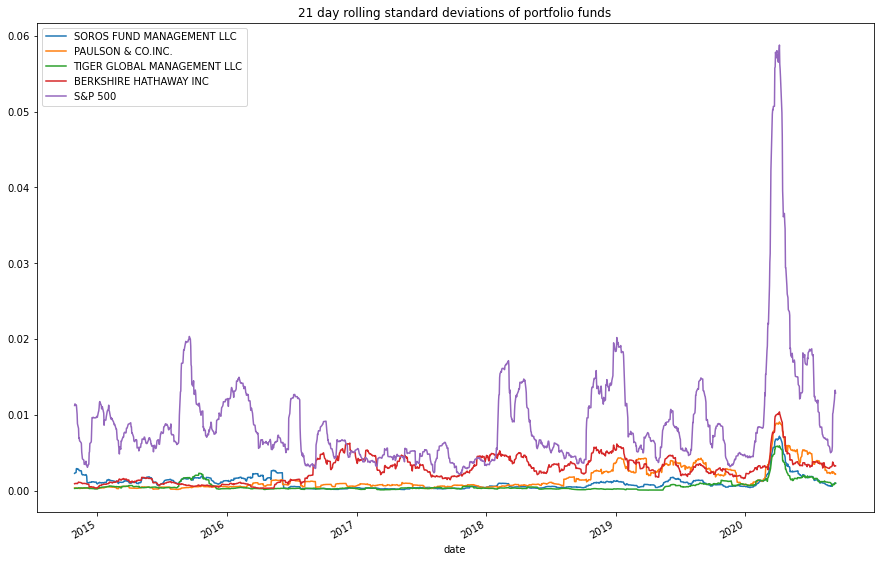

# investment_strategy_evals
Evaluating different investment strategies and making recommendations using python pandas.

## Technologies

In this project we are utilizing Python 3, Jupyter Lab, and the Pandas Library  
Pandas library -- Incredibly useful Python library for data science and data analysis  
Jupyter Lab -- Robust environment to be able to view and edit devopment projects in a streamlined system.

---

## Installation Guide

* Pandas -- The source code is currently hosted on GitHub at: https://github.com/pandas-dev/pandas

Binary installers for the latest released version are available at the Python Package Index (PyPI) and on Conda.

### conda
`conda install pandas`
### or PyPI
`pip install pandas`

* Jupyter Lab -- 
    [Link for detailed instructions on installing Jupyter Lab here.](https://jupyter.org/install)  
    
## Dependencies:  

numpy -- `import numpy as np`  
Path -- `from pathlib import Path`

---

## Usage

## There are several examples of different analyses of four different investment funds returns, volatility, risk-return ratios and covariance vs the S&P 500  

-We intially read in a csv file containing fund return information into a pandas dataframe.  While there is a file included in the resources folder of this repository ['whale_navs_csv'](./Resources/whale_navs.csv) that can be used for data inputs, other csv files could be used containing historical returns of other funds.  

`whale_df = pd.read_csv(Path('./Resources/whale_navs.csv'), index_col = 'date', parse_dates = True, infer_datetime_format = True)`  

We then use the `.pct_change` method on the resulting dataframe to give us the return data we will use throughout the rest of the project to plot our comparative metrics.

### Here we initially compare cumulative returns of the four funds vs the S&P --  

`cumulative_returns.plot(figsize = (20, 10), title = 'Cumulative returns of portfolios over time')`

### Here we analyze risk by plotting the 21 day rolling standard deviations of the four funds --  

`rolling_21_std = daily_returns.rolling(window = 21).std().dropna()
rolling_21_std.plot(figsize = (15,10), title = '21 day rolling standard deviations of portfolio funds')`  

### The risk-return of each fund plotted via box plot using the sharpe ratio --  

`sharpe_ratios.plot(kind = 'bar', title = 'Sharpe ratios for four portfolios and the S & P 500')`  

### Plotting the rolling beta of the two funds that we are comparing for recommendation --  

`tiger_beta.plot(title = 'Rolling beta of Tiger Management fund using a 60 day window')`  
`berkshire_beta.plot(title = 'Rolling beta of Berkshire Hathaway fund using a 60 day window')`  

  

## Data and formulas can be manipulated to assess other datasets by importing different data and changing the formulas to reflect the needed changes.

---

## License

Licensed under the [MIT License](https://github.com/git/git-scm.com/blob/main/MIT-LICENSE.txt)  Copyright 2021 Dave Thomas.

